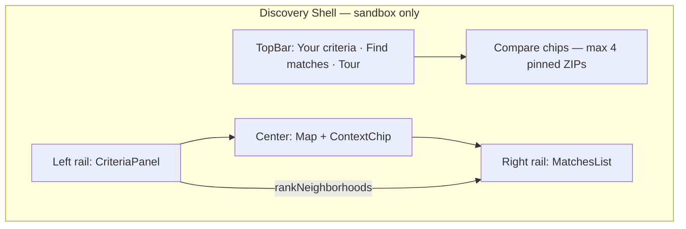

# Discovery Criteria UX v2 — Hybrid Design Specification

**Status:** Accepted (2026-07-12)  
**Authority:** ADR-014 (scoring semantics), ADR-009 (shell), ADR-013 (sandbox scope)  
**Supersedes (UI layer):** WMIL-clone terminology in `wishlist-discovery.md`  
**Epic:** E008 — Discovery Engine  
**Competitor benchmark:** [Where Might I Live](https://wheremightilive.com)

---

## Executive Summary

Cineborough's discovery shell (commit `4839aab`) blended WMIL's addable criteria cards and partial Match % with Cineborough's investor/hope-core identity. This v2 spec **renames and refines** that shell using Cineborough-native vocabulary — no "wish" language in user-facing UI — while preserving partial-match scoring from `hybrid-scoring.ts`.

**Design thesis:** Partial matches are the hero. Each criterion is independently addable. Histograms anchor sliders in market context. Compare chips enable multi-location thinking without losing map focus. Cineborough differentiators (provenance badges, investor metrics, tour CTA) stay visible.

---

## Terminology Glossary

| Term | Usage | Avoid |
|------|-------|-------|
| **Criterion** (pl. **criteria**) | A single metric + target range the user cares about | wish, filter (user-facing) |
| **Your criteria** | Left-rail panel title | My Wishes, Wishlist |
| **+ Add criterion** | Primary add action | + Add a Wish |
| **Criterion card** | Individual editable metric card with slider | wish card |
| **Match %** | Composite partial-match score (0–100) | hybrid score |
| **Matches** | Ranked neighborhoods in right rail | results list |
| **Compare** | Pinned locations above map (max 4) | — |
| **Signals** | Investor Signals category label only | — |

Internal code uses `DiscoveryCriteria`, `DiscoveryFilter`, `CriterionCategory` — aligned with existing data model.

---

## Information Architecture



### Three-pane layout

| Pane | Width | Background | Role |
|------|-------|------------|------|
| **Left — Your criteria** | 300px | Dark rail `#14141f` | Add/remove criterion cards, histogram sliders, live match preview |
| **Center — Map** | flex | Light map canvas | Choropleth, compare chips, context chip, tour CTA |
| **Right — Matches** | 280px | Dark rail `#14141f` | All sandbox ZIPs ranked by Match %; favorites |

Metric choropleth sidebar is **hidden** during discovery mode (`cinematic--discovery`). Returns when user exits discovery shell.

---

## Metric Taxonomy (Hybrid)

Two category systems coexist — intentional, not a WMIL clone:

### Choropleth sidebar (map exploration)

`MetricLayerCategory` — Reventure-leaning groups for layer toggling:

- Demographics
- Market & Economics
- Lifestyle & Walkability
- Investor Signals
- Education & Schools

### Criterion picker (discovery add flow)

`CriterionCategory` — lifestyle-first groups with investor lane:

| Category | Example metrics | Cineborough note |
|----------|-----------------|------------------|
| **Housing & Market** | Median Home Price, 1-Yr Forecast, Cap Rate, Days on Market, Seller Motivation, Home Value Growth | Renamed consumer labels |
| **Demographics** | Median Age, Population Growth, Remote Work % | ACS live |
| **Education** | Education Level | School Rating placeholder (T075) |
| **Environment** | Walk Score | Park proxy future (T075) |
| **Health** | — | Physicians / 10k (T075) |
| **Commute & Access** | — | Airport drive time (T075) |
| **Investor Signals** | Overvaluation %, Market PSF | Hope-core moat — WMIL lacks this |

---

## Component Map

| Surface | Component | CSS prefix |
|---------|-----------|------------|
| Left rail | `CriteriaPanel` | `criteria-panel`, `criterion-card` |
| Histogram slider | `CriterionRangeSlider` | `criterion-range` |
| Add flow modal | `CriterionCategoryPicker` | `criterion-picker` |
| Right rail | `MatchesList` | `matches-list` |
| Map compare bar | `CompareChips` | `compare-chips` |
| Legacy drawer | `DiscoveryCriteriaPanel` | `discovery-criteria` (unchanged) |

Data layer:

| Artifact | Path |
|----------|------|
| Criterion categories | `packages/data/src/criterion-metrics.ts` |
| Histogram bins | `packages/data/src/criterion-histogram.ts` |
| Partial-match scoring | `packages/data/src/hybrid-scoring.ts` |
| Storage | `apps/web/src/lib/discovery-criteria-storage.ts` |

---

## Wireframe Descriptions

### TopBar (discovery mode)

```
┌──────────────────────────────────────────────────────────────────────────┐
│ Cineborough · DC Metro    [Search…]   [Your criteria]  [Find matches]   │
└──────────────────────────────────────────────────────────────────────────┘
```

- **Your criteria** — opens/expands left rail (already visible in shell)
- **Find matches** — re-ranks all sandbox ZIPs; populates right rail + compare chips

### Left rail — Your criteria

```
┌─ Your criteria ─────────────────────┐
│ Set what matters. Every neighborhood │
│ gets a Match %.                      │
│                                      │
│ ┌─ Median Home Price ────────── [×] │
│ │ [████ histogram ████░░░░]         │
│ │ $400k ─────────────── $850k       │
│ └───────────────────────────────────│
│ ┌─ Walk Score ───────────────── [×] │
│ │ [histogram + slider]              │
│ └───────────────────────────────────│
│                                      │
│ [+ Add criterion]                    │
│                                      │
│ 42 of 68 neighborhoods ≥40% match   │
│ [Reset]              [Find matches]  │
└──────────────────────────────────────┘
```

**Empty state:** "No criteria yet — add metrics that matter to you."

**Live preview:** Count of neighborhoods meeting `DISCOVERY_MATCH_THRESHOLD` (40%) updates on slider drag.

### Right rail — Matches

```
┌─ Matches · 68 neighborhoods ──────┐
│ ♡ 22201  Arlington        ┌──────┐  │
│                           │ 98%  │  │
│                           └──────┘  │
│ ♥ 22204  Clarendon        ┌──────┐  │
│                           │ 94%  │  │
│                           └──────┘  │
│ …                                   │
└─────────────────────────────────────┘
```

**Match % badge** is the hero element — large tabular nums, accent fill when ≥90%, amber 70–89, muted below.

### Compare chips (above map)

```
[ 22201 · Arlington  98% × ] [ 22204 · Clarendon  94% × ] [ 20001 · Shaw  87% × ]
```

Auto-pins top 3 on first Find matches. Active chip gets pink border + soft fill.

---

## Color & Type Scale

### Discovery rails (dark discipline — WMIL-inspired)

| Token | Value | Use |
|-------|-------|-----|
| `--discovery-rail-bg` | `#14141f` | Panel background |
| `--discovery-rail-surface` | `#1c1c2a` | Criterion cards |
| `--discovery-rail-border` | `#2a2a3d` | Dividers |
| `--discovery-rail-text` | `#e2e8f0` | Primary text |
| `--discovery-rail-muted` | `#94a3b8` | Secondary text |

### Cineborough accent (unchanged)

| Token | Value | Use |
|-------|-------|-----|
| `--accent` | `#e11d48` | Active chip, CTA, ≥90% match badge |
| `--accent-soft` | `#fff1f2` | Active chip background (light contexts) |

### Typography

| Element | Size | Weight | Notes |
|---------|------|--------|-------|
| Panel title | 0.9375rem | 600 | Your criteria, Matches |
| Criterion label | 0.8125rem | 600 | Card header |
| Match % badge | 1rem | 700 | `font-variant-numeric: tabular-nums` |
| Intro copy | 0.75rem | 400 | Muted, 1.45 line-height |
| Category picker h4 | 0.6875rem | 600 | Uppercase, letter-spacing 0.06em |

### Match % color tiers

| Range | Background | Label |
|-------|------------|-------|
| ≥ 90% | `rgba(225, 29, 72, 0.18)` + accent text | Strong match |
| 70–89% | `rgba(245, 158, 11, 0.15)` + amber text | Close match |
| < 70% | `rgba(148, 163, 184, 0.12)` + muted text | Partial match |

---

## Interaction Principles

1. **Partial matches first-class** — all sandbox ZIPs ranked; no hard-filter dead-end.
2. **Independent criteria** — add/remove any metric without section grouping prison.
3. **Histogram context** — 20-bin distribution shows "where you sit in the market."
4. **Compare without losing map** — chips pin up to 4; click swaps detail focus.
5. **Cineborough moat visible** — provenance on All Data tab, Investor Signals category, tour CTA in TopBar.

---

## Deferred (existing tickets)

| Ticket | Feature |
|--------|---------|
| T070 | Priority / heatmap / Just This toggles on criterion cards |
| T071 | Match breakdown + Criteria vs All Data tabs |
| T072 | Compare chip pin-from-map action |
| T075 | New metrics (park proxy, physicians, airport, school) |
| T076 | By Example similarity mode |

---

## Acceptance Checklist (T077)

- [x] No "wish" in user-facing UI, component names, or CSS class prefixes
- [x] `CriteriaPanel`, `CriterionRangeSlider`, `CriterionCategoryPicker` replace Wish* components
- [x] `CriterionCategory` + `criterionCategory` in types (replaces wishCategory)
- [x] Three-pane discovery layout with dark rails + pink accent
- [x] Match % badge hero styling in MatchesList and CompareChips
- [x] Design doc at this path

---

## References

- ADR-014 — Discovery scoring semantics (partial Match %)
- `docs/specifications/wishlist-discovery.md` — prior WMIL-parity spec (historical)
- `hybrid-scoring.ts`, `CinematicDiscovery.tsx`, `globals.css`
