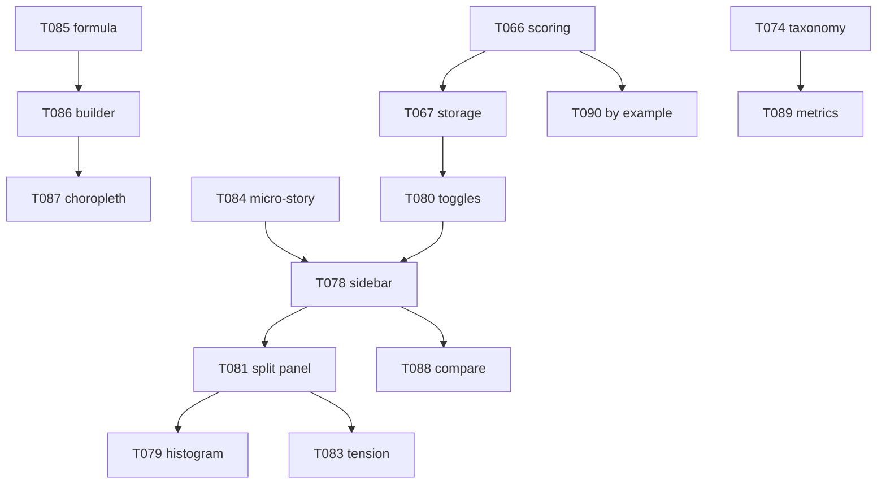

# Discovery Moat Roadmap

**Status:** Accepted (2026-07-12)  
**Authority:** ADR-015, ADR-014, `docs/specifications/discovery-criteria-ux-v2.md`  
**Epic:** E009 — Discovery Moat & Match Engine  
**Sprint:** S015

---

## Executive Summary

Cineborough discovery evolves in three phases: **MVP** (close WMIL interaction gaps), **v2** (deep-dive + compare polish), **moat** (investor/hope-core tension, cinematic micro-stories, custom indices). S014 delivered the hybrid shell (T077); S015 completes parity and layers differentiation WMIL cannot copy.

---

## Phase Overview

```mermaid
flowchart LR
  subgraph p1 [Phase 1 — WMIL Parity MVP]
    T080[Priority toggles]
    T078[Fly-to sidebar]
    T081[Split panel]
  end
  subgraph p2 [Phase 2 — Discovery v2]
    T079[Histogram polish]
    T088[Compare pins]
    T082[Terminology audit]
    T089[New metrics]
  end
  subgraph p3 [Phase 3 — Moat]
    T083[Tension slider]
    T084[Micro-storytelling]
    T085[T087[Custom indices]]
  end
  p1 --> p2 --> p3
```

| Phase | Goal | Tickets | Exit criteria |
|-------|------|---------|---------------|
| **MVP** | WMIL interaction parity | T066, T067, T080, T078, T081 | User can set criteria, toggle priority/heatmap, browse state-grouped matches, flyTo ZIP, inspect split-panel breakdown |
| **v2** | Polish + metric expansion | T079, T088, T082, T089, T090 | Histograms match WMIL fidelity; compare workflow complete; 4 new criterion metrics live |
| **Moat** | Cineborough differentiation | T083, T084, T085–T087 | Tension slider shifts ranking; micro-story on select; user builds "Digital Nomad Yield Index" and sees it on map |

---

## Phase 1 — WMIL Parity MVP

### Prerequisites (S014 carry)

| Ticket | Deliverable |
|--------|-------------|
| **T066** | `wishlist-scoring.ts` — partial Match % per criterion, weighted composite |
| **T067** | Storage v3 — priority, heatmap, sortMode persisted |

### Core S015 tickets

#### T080 — Criterion priority toggles

Per-criterion card controls:

- **Heatmap** — one active; sets `MapView` active metric layer + band overlay
- **High Priority** — weight ×2 in composite
- **Just This** — sort matches by single criterion

**Acceptance:** Toggle state survives page reload; heatmap deactivates previous criterion.

#### T078 — State-grouped fly-to matches sidebar

Enhance `MatchesList`:

```
┌─ Matches · 68 neighborhoods ──────┐
│ ▼ Virginia (24)                   │
│   ♡ 22201  Arlington      [98%]   │  ← click → flyTo
│   ♥ 22204  Clarendon      [94%]   │
│ ▼ Florida (16)                    │
│   ♡ 32801  Orlando        [87%]   │
│ ▼ California (28)                 │
│   …                               │
└───────────────────────────────────┘
```

**Acceptance:** Groups by state; collapse/expand; click triggers pitched `flyTo`; compare chip syncs.

#### T081 — Deep-dive split panel

Discovery-mode location detail:

| Zone | Content |
|------|---------|
| Hero | Neighborhood photo (T064 pipeline), ZIP + Match % |
| Tabs — **My Criteria** | Composite %, per-criterion pass/close/no-match rows, mini band sliders |
| Tabs — **All Data** | Full investor + hope-core blocks, provenance badges |
| Footer | External links (Google Maps, Walk Score proxy placeholder) |

**Acceptance:** Replaces drawer-only flow in discovery shell; scroll-safe on narrow viewports.

### Phase 1 implementation order

```
T066 → T067 → T080 → T078 → T081
```

**Rationale:** Scoring + storage unblock toggles; toggles unblock heatmap-sidebar loop; sidebar flyTo needs stable selection state; split panel consumes breakdown from scoring engine.

---

## Phase 2 — Discovery v2 (Polish + Expansion)

#### T079 — Histogram distribution polish

- Bar chart under slider handles with hover bin count
- Criterion band shaded on histogram
- Sync with Heatmap toggle overlay

#### T088 — Compare chips pin-from-map

- Click ZIP on map → offer pin to compare bar (max 4)
- Drag-reorder chips; active chip border per `discovery-criteria-ux-v2.md`

#### T082 — Criteria terminology audit

- Grep/lint guard: no "wish" in `apps/web/src/components/*Discovery*`, `*Criteria*`, `*Matches*`
- Update stale user-facing strings in `CinematicDiscovery`, `TopBar`, tooltips
- Document internal `Wish*` deprecation timeline

#### T089 — New criterion metrics

Per ADR-014 §5 / T075:

| Metric | Source | Status |
|--------|--------|--------|
| Park & Walk Score proxy | OSM | ingest |
| Physicians / 10k | ACS B08124-derived | ingest |
| Airport drive time | OSRM placeholder | mock |
| School Rating | Placeholder | mock |

#### T090 — By Example similarity

- Pin 1–3 liked ZIPs → cosine similarity on normalized metric vector
- Complementary tab on criteria panel; does not replace criterion matching

### Phase 2 order

```
T079 → T088 → T082 → T089 → T090
```

---

## Phase 3 — Cineborough Moat

### T083 — Investor ↔ Hope-Core tension slider + quadrant

**UI:** Horizontal slider with labels "Investor signals" ↔ "Livability signals".

**Effect:**

- Reweights default criterion suggestions when slider moves
- Quadrant scatter overlay: x = investor composite, y = hope-core composite per ZIP
- Optional: blend into Match % as persona modifier (±10% cap)

**Differentiation:** Makes ADR-001 thesis visible — WMIL has no investor lane.

### T084 — Cinematic micro-storytelling on location select

Triggered on matches-list or compare-chip select (not full tour):

1. GSAP eased `flyTo` (2–3s, pitch 45°)
2. `LocaleQuoteCard` fades in at ZIP anchor
3. Optional amenity POI pulse (E002 T051)

Distinct from E007 top-3 flyover — single-location, interruptible.

### T085–T087 — Custom index stack

| Ticket | Scope |
|--------|-------|
| **T085** | `CustomIndex` type, formula evaluator, normalization, schema doc update |
| **T086** | Builder UI: name field, metric picker, weight sliders, live preview histogram |
| **T087** | Choropleth layer registration, discovery sort option, localStorage persistence |

**Example preset:** Digital Nomad Yield Index = `remoteWorkPct × 2 + capRateProxy × 1.5 − overvaluationPct`

### Phase 3 order

```
T083 → T084 → T085 → T086 → T087
```

---

## Dependency Graph



---

## Success Metrics

| Metric | Target |
|--------|--------|
| WMIL parity checklist | 5/5 Part 1 gaps closed |
| Discovery session depth | ≥3 ZIP flyTo selects per session (analytics stub) |
| Custom index creation | ≥1 saved index per power-user test session |
| Terminology | 0 "wish" strings in user-facing discovery UI |

---

## Out of Scope (this roadmap)

- Nationwide criterion discovery
- Live school/crime API integrations
- Property-level custom indices (E004 / Phase 3)
- Full ADR-008 scroll scrollytelling rebuild

---

## References

- ADR-015 — Discovery Moat Strategy
- `docs/specifications/discovery-criteria-ux-v2.md`
- `docs/schema/opportunity-index.md`
- Epic E009, Sprint S015 (`beads/sprints/S015-discovery-moat/`)
