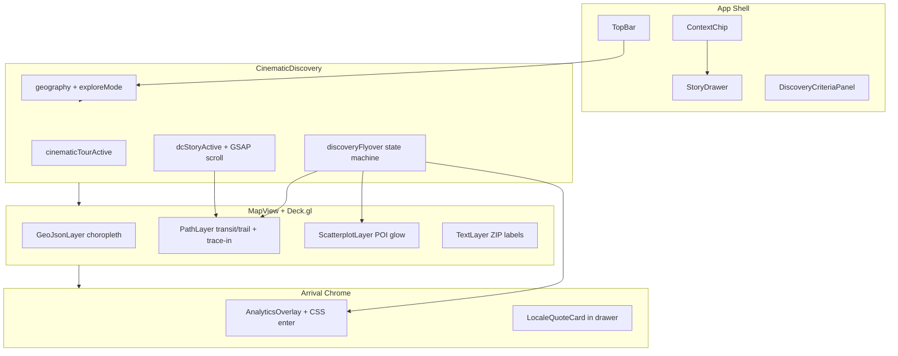

# Phase 2 — Cinematic UX Specification

**Status:** Draft (2026-07-11)  
**Authority:** ADR-008, ADR-006, `docs/vision/user-journey.md`, E002, E007  
**Scope:** DC + Orlando sandbox metros only (Phase 1 constraint)

---

## Executive Summary

Phase 2 delivers **hope-core neighborhood immersion** — the feeling that "I can *feel* what living here would be like" — without requiring Google 3D Photorealistic Tiles. The work splits into two delivery phases:

| Phase | Focus | 3D Tiles? |
|-------|-------|-----------|
| **2a (now)** | Pitched 2D flyovers, amenity highlights, route trace-in, unified tour chrome, analytics card entrance | No |
| **2b (gated)** | Google 3D tiles, scroll-driven GSAP camera paths, 4K photography, Framer Motion choreography | Yes (API + cost approval) |

Phase 2a is implementable today on the existing Deck.gl + Mapbox stack. Phase 2b requires an ADR amendment and Google Maps Platform billing gate.

---

## Grill Q&A (Document Interrogation)

### 1. What is Phase 2 vs what's already shipped (S002, S010 T044)?

| Shipped (done) | Still Phase 2 |
|----------------|---------------|
| **S002 / E002:** GSAP scroll layout shell (DC metro → neighborhood → detail), locale quote card, map camera transitions, Deck.gl PathLayer (Arlington Orange Line), real ZCTA boundaries | Google 3D Photorealistic Tiles |
| **S010 T044:** Top-3 discovery flyover (pitched camera to ranked ZIP centroids), context chip tour progress, skip tour, analytics overlay on highlight | Green-space/amenity map highlights (deferred in T044) |
| **S010 T045:** Reventure-style analytics overlay with provenance badges | Route path trace-in animation on flyover arrival |
| **S010 T039:** Compact context chip + drawer (replaced bottom scroll panels) | Unified cinematic chrome across scroll story + discovery tour |
| State-default overview, flat geography tabs, buyer-affordability Home Value colors | Framer Motion data card choreography, 4K neighborhood photography |

**Key insight:** S002 built the *DC scroll story* infrastructure. S010 built the *criteria-driven discovery tour*. Phase 2a unifies their cinematic layers and fills the amenity/route gaps T044 deferred.

### 2. What requires 3D tiles vs achievable on Mapbox 2D + pitch?

| Capability | 2D + pitch (Phase 2a) | 3D tiles (Phase 2b) |
|------------|----------------------|---------------------|
| Metro → neighborhood camera descent | ✅ `discoveryFlyoverCamera()`, GSAP scroll scrub | ✅ Building-level immersion |
| Transit/walk route overlays | ✅ Deck.gl PathLayer + trace-in animation | ✅ Routes draped on buildings |
| Green-space/amenity highlights | ✅ ScatterplotLayer POI glow (mock → OSM) | ✅ Trees/parks at street level |
| Locale quote cards | ✅ Blurred static cards (T007) | ✅ Over satellite photography |
| Data card fade-in | ✅ CSS transitions (overlay entrance) | ✅ Framer Motion choreography |
| Scroll-driven camera path | ✅ GSAP ScrollTrigger (DC story) | ✅ Choreographed over 3D terrain |
| 4K neighborhood photography | ❌ | ✅ Static hero transitions |

**Decision:** Pitch + outdoors Mapbox style + Deck.gl overlays deliver 80% of the hope-core psychological goal. 3D tiles are polish, not MVP.

### 3. What's the minimum cinematic upgrade that matches hope-core persona?

The data-hungry investor-homebuyer needs **evidence-based hope**, not vibe-only marketing. Minimum viable cinematic upgrade:

1. **Criteria → Recommend → Validate** journey (E007) with pitched flyover to top 3
2. **Amenity/green-space POI glow** at each flyover stop — "people like me walk to parks and coffee here"
3. **Route trace-in** (transit/trail path animates as camera arrives) — spatial continuity
4. **Analytics card entrance** on arrival — ROI credibility immediately visible
5. **Unified tour chrome** (context chip + drawer) whether scroll story or discovery tour

Defer: 3D buildings, 4K photography, full GSAP rewrite, Framer Motion dependency.

### 4. Green-space/amenity highlights on flyover — how to implement without 3D?

**Phase 2a (mock):**
- `data/mock/sandbox-amenities.geojson` — 3 POIs per sandbox ZIP (park, transit, coffee) offset from ZCTA centroids
- `loadAmenityPois(zip)` in `@cineborough/data`
- Deck.gl `ScatterplotLayer` — green glow (park), blue (transit), amber (coffee)
- Visible during discovery flyover `highlight` phase only

**Phase 2b (live, T048):**
- OSM Overpass batch at ZCTA centroid → real park/transit/amenity coordinates
- Replace mock loader; same ScatterplotLayer rendering

### 5. Scroll story vs discovery flyover — unify or keep separate?

**Keep separate flows, unify chrome:**

| Flow | Trigger | Camera | Content |
|------|---------|--------|---------|
| **DC scroll story** | Drill into DC sandbox, scroll page | GSAP scrub → `CINEMATIC_CAMERAS` | Metro → neighborhood → detail sections |
| **Discovery tour** | "Find neighborhoods" after criteria | Sequential `discoveryFlyoverCamera()` | Top 3 ranked ZIPs with analytics |

**Shared chrome (`cinematicTourActive` flag):**
- Context chip (step label, title, detail, action)
- Story drawer (analytics / zip detail)
- Path + amenity map layers
- `cinematic--tour` CSS modifier

Neither flow blocks the other. Discovery tour pauses DC scroll story (`!discoveryFlyoverActive` guard on `dcStoryActive`).

### 6. What breaks with current overview-first UX (State default, flat tabs)?

| Constraint | Risk | Mitigation |
|------------|------|------------|
| **State default** on landing | Scroll story hidden until user drills into DC sandbox | Discovery tour requires sandbox drill first; guidance chip for non-sandbox metros |
| **Flat overview tabs** (national/state/metro/county) | Scroll-driven descent conflicts with overview choropleth | Scroll sections only mount when `!isOverviewMode && dcStoryActive` |
| **Buyer-affordability Home Value colors** | Cinematic overlays must not override choropleth palette | Amenity/path layers are additive Deck.gl overlays; metric layer picker unchanged |
| **Orlando flat view** (no scroll story) | DC-only scroll story | Discovery tour works in both sandboxes; Orlando gets flyover + amenities |

**Non-goals:** Do not change default geography, do not remove flat tabs, do not alter `medianHomeValue` tercile semantics.

---

## Persona & Journey

### Persona
Data-hungry investor-homebuyer (Gen Z / millennial): wants cap-rate math *and* neighborhood belonging proof.

### Journey Mapping

```
┌─────────────┐     ┌──────────────┐     ┌─────────────┐
│  A: Criteria │ ──► │ B: Recommend │ ──► │ C: Validate │
│  budget +    │     │ top 3 flyover│     │ analytics   │
│  hybrid filt │     │ + amenities  │     │ overlay     │
└─────────────┘     └──────────────┘     └─────────────┘
     T042               T044/T051            T045/T052
```

**Psychological arc:**
- A: "Viable options exist — show me where"
- B: "I can *feel* what living here would be like" (Phase 2a target)
- C: "The math works — I have a tactical edge"

---

## Phased Delivery

### Phase 2a — 2D Cinematic (no 3D tiles)

**Epic:** E002 (amend status → `in_progress`)  
**Sprint:** S011 — Phase 2a Cinematic Polish

| Ticket | Title | Priority |
|--------|-------|----------|
| T051 | Amenity POI highlight layer on discovery flyover | P1 |
| T052 | Route path trace-in animation on flyover arrival | P1 |
| T053 | Analytics overlay CSS entrance + unified tour chrome | P2 |
| T054 | Orlando transit/trail path mock data | P2 |
| T055 | Phase 2a manual QA (DC + Orlando end-to-end) | P2 |

**Implemented in this session:** T051, T052, T053 (partial T054).

### Phase 2b — 3D Cinematic (Google tiles gate)

**Prerequisites:**
- Google Maps Platform 3D Photorealistic Tiles API token
- Cost approval (per E002 deferred notes)
- ADR-008 amendment documenting stack confirmation

| Ticket | Title | Priority |
|--------|-------|----------|
| T056 | Google 3D tiles integration stub + feature flag | P1 |
| T057 | GSAP ScrollTrigger camera paths over 3D terrain | P1 |
| T058 | Framer Motion data card choreography | P2 |
| T059 | Static 4K neighborhood photography transitions | P3 |
| T060 | Locale quote card over blurred satellite imagery | P2 |

---

## Component Architecture



### State Machine: Discovery Flyover

```
idle → flying (camera ease, path trace 0→1)
     → highlight (amenities glow, analytics enter, drawer open)
     → flying (next ZIP) | complete
```

---

## Ticket Breakdown (T051+)

### T051 — Amenity POI highlight layer

**Acceptance:**
- [ ] Mock POI GeoJSON for all DC + Orlando sandbox ZIPs
- [ ] `loadAmenityPois(zip)` exported from `@cineborough/data`
- [ ] ScatterplotLayer renders park/transit/coffee during flyover `highlight` phase
- [ ] No impact on overview choropleth or Home Value colors

### T052 — Route path trace-in animation

**Acceptance:**
- [ ] Path animates 0→100% during `flying` phase (synced to `FLYOVER_CAMERA_MS`)
- [ ] Full path visible during `highlight` phase
- [ ] ZIP-filtered paths (DC 22201 Orange Line, Orlando 32801 SunRail)
- [ ] Reuses existing `loadTransitPaths()` loader

### T053 — Unified cinematic tour chrome

**Acceptance:**
- [ ] `cinematicTourActive` flag drives `cinematic--tour` CSS class
- [ ] Analytics overlay CSS entrance on highlight arrival
- [ ] Context chip + drawer shared across scroll story and discovery tour

### T054 — Orlando transit path mock

**Acceptance:**
- [ ] `data/mock/orlando-transit-path.geojson` with SunRail + Lake Eola trail
- [ ] `loadTransitPaths(zip)` filters by ZIP

### T055 — Phase 2a QA

**Acceptance:**
- [ ] DC sandbox: criteria → flyover → amenities → analytics → tour complete
- [ ] Orlando sandbox: same flow
- [ ] Overview (State default) unchanged
- [ ] `pnpm typecheck` + `pnpm lint` pass

### T056–T060 — Phase 2b (deferred)

See Phase 2b table above. Blocked on Google 3D tiles API gate.

---

## Dependencies on Live Data (T046–T048)

| Ticket | Data Source | Cinematic Impact |
|--------|-------------|------------------|
| **T046** Redfin ingest | DOM, PSF, price drops | Richer analytics overlay (seller desperation live) |
| **T047** Zillow market metrics | DOM cross-check | Provenance badges upgrade from mock |
| **T048** OSM walkability batch | Park/transit/amenity coords | Replaces `sandbox-amenities.geojson` mock with real POIs |
| **T049** Seller desperation derived | T046 inputs | Analytics overlay live score |

**Phase 2a uses mock POIs and mock transit paths.** T048 unlocks real amenity coordinates without changing the ScatterplotLayer architecture.

---

## Files

| Path | Role |
|------|------|
| `apps/web/src/components/CinematicDiscovery.tsx` | Tour orchestration, flyover state machine |
| `apps/web/src/components/MapView.tsx` | Deck.gl layers (choropleth, paths, amenities) |
| `apps/web/src/components/AnalyticsOverlay.tsx` | Arrival analytics card |
| `packages/data/src/amenity-pois.ts` | Mock POI loader |
| `packages/data/src/paths.ts` | Transit/trail path loader |
| `data/mock/sandbox-amenities.geojson` | Mock amenity coordinates |
| `data/mock/orlando-transit-path.geojson` | Orlando route mock |
| `apps/web/src/lib/path-trace.ts` | LineString trace-in utility |

---

## Recommended Phase 2b Sequence

1. **T056** — Google 3D tiles behind `NEXT_PUBLIC_ENABLE_3D_TILES` flag (fail-safe to 2D)
2. **T048** — OSM amenity ingest (parallel; improves 2D layer quality even without 3D)
3. **T057** — GSAP camera paths over 3D terrain (DC scroll story upgrade)
4. **T058** — Framer Motion card choreography (add dependency only when needed)
5. **T059/T060** — Photography + locale quote polish
