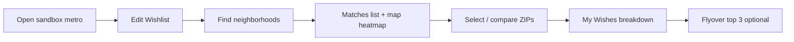

# Wishlist Discovery — UX Specification

**Status:** Accepted (2026-07-12)  
**Authority:** ADR-014, ADR-009, ADR-013  
**Epic:** E008 — Wishlist Discovery  
**Competitor benchmark:** [Where Might I Live](https://wheremightilive.com)

---

## Executive Summary

Cineborough's discovery journey (E007) ranks neighborhoods with hard filters and a relative hybrid score. Users report criteria feels inert and metrics UX lags WMIL. This spec defines **Wishlist Discovery** — wish cards with histogram sliders, partial Match %, per-wish breakdown, compare chips, and a ranked matches list — while preserving hope-core + investor differentiation.

**Phase 1 of E008 (S014):** Scoring engine + wish UI + matches list + breakdown.  
**Phase 2 (S014 tail / follow-on):** New metrics (park proxy, physicians, airport, school placeholder) + By Example mode.

---

## Competitor Reference (WMIL)

Screenshots from product grill-me session (conversation assets). Key patterns to parity:

| Pattern | WMIL behavior | Cineborough target |
|---------|---------------|-------------------|
| Wish cards | Each metric is an addable card, not grouped filters | Replace `DiscoveryCriteriaPanel` filter rows |
| + Add a Wish | Category browser: Demographics, Education, Crime, Environment, Activities, … | `WishCategoryPicker` modal |
| Range + histogram | Slider with distribution histogram behind handles | `WishRangeSlider` from shard values |
| Heatmap toggle | Choropleth switches to that metric | Wire to `MapView` active layer |
| High Priority | Weighted higher in match % | `priority: "high"` → 2× weight |
| Just This | Sort by single wish | `sortMode: "single"` |
| Partial matches | 87%, 94%, 98%, 100% on list + chips | `matchPct` on every ranked ZIP |
| Match breakdown | Pass / close / no-match per wish + mini sliders | `WishMatchBreakdown` in drawer |
| My Wishes vs All Data | Tabbed detail panel | Extend `ZipDetailPanel` / analytics |
| Compare chips | Alameda 95%, Orange County 98% at top | `CompareChips` bar (max 4) |
| Matches list | Ranked sidebar, heart favorites | `MatchesList` left rail |
| Cleaner labels | Median Home Price, Park Score, School Rating | Taxonomy v2 (T074) |
| By Example | "Places you like" similarity | T076 deferred |

**Intentional differences (hope-core moat):**

- Keep Investor Signals category (cap rate, overvaluation, seller motivation) — WMIL skews lifestyle-only
- Retain provenance badges (ACS, ZHVI, Redfin) on All Data tab
- Cinematic flyover to top 3 matches (E007) — WMIL has no equivalent
- Opportunity Index remains default map layer outside discovery mode

---

## User Journey



### 1. Entry

- User drills into sandbox (DC, Orlando, SF Bay, San Jose) via search or geography
- **Find neighborhoods** CTA enabled (existing `TopBar`)
- Wishlist loads from `sessionStorage` v3 or migrates from v2 criteria

### 2. Wishlist panel (replaces Discovery Criteria)

**Layout:** Right drawer (`StoryDrawer`), title **My Wishes**

```
┌─────────────────────────────────────┐
│ My Wishes                      [×]  │
├─────────────────────────────────────┤
│ ┌─ Median Home Price ─────────────┐ │
│ │ [histogram + dual slider]       │ │
│ │ ○ Heatmap  ○ High Priority      │ │
│ │ ○ Just This              [drop] │ │
│ └─────────────────────────────────┘ │
│ ┌─ Park & Walk Score ─────────────┐ │
│ │ ...                             │ │
│ └─────────────────────────────────┘ │
│ [+ Add a Wish]                      │
│ [Reset]              [Find matches] │
└─────────────────────────────────────┘
```

**Empty state:** "No wishes yet — add what matters to you. Every neighborhood gets a Match %."

**Actions:**

- **+ Add a Wish** → category picker (§3)
- **Drop** (×) removes wish
- **Find matches** applies wishlist + runs `rankByWishlist()` → opens matches list
- **Reset** restores sandbox default wishes (per-CBSA presets, see §6)

### 3. Add a Wish — category picker

Modal or inline expander with categories (ADR-014 §5):

| Category | Wishes available (MVP) | Future (T075) |
|----------|------------------------|---------------|
| Housing & Market | Median Home Price, 1-Yr Forecast, Cap Rate, Days on Market, Seller Motivation, Home Value Growth | — |
| Demographics | Median Age, Population Growth, Remote Work % | — |
| Education | Education Level (college degree %) | School Rating (placeholder) |
| Environment | Park & Walk Score | Park Score proxy (OSM parks ÷ area) |
| Health | — | Physicians per 10k (ACS) |
| Commute & Access | — | Airport drive time (mock isochrone) |
| Investor Signals | Overvaluation %, Market PSF | — |

Already-added metrics grayed out. Selecting a metric appends a wish with category defaults (min/max from `wish-metrics.ts`).

### 4. Wish range slider + histogram

**Component:** `WishRangeSlider`

- Background: 20-bin histogram of metric values across active sandbox shard
- Foreground: dual handles for min/max (single handle for min-only / max-only kinds)
- Tick labels: formatted values ($, %, days)
- Drag updates wish in local draft; Apply commits

Histogram data source: `getShardMetricHistogram(geoJson, metric, bins=20)` — computed once per panel open, memoized.

### 5. Per-wish toggles

| Toggle | UI | Map / sort effect |
|--------|-----|-------------------|
| **Heatmap** | Radio-style (one active) | `setActiveMetric(wish.metric)` + wish band overlay on legend |
| **High Priority** | Checkbox | 2× weight in Match % |
| **Just This** | Checkbox | `sortMode: "single"` + `sortWishId`; list re-sorts live |

When Heatmap active, choropleth fill reflects metric magnitude; legend shows shaded band for wish min–max.

### 6. Default wishes (sandbox presets)

Permissive-enough to always return matches, but visually meaningful:

| Sandbox | Default wishes |
|---------|----------------|
| All | Park & Walk Score min 30; Median Home Price max metro-dependent ceiling |
| San Jose (41940) | Relaxed home price max; walk min 25 (existing `SAN_JOSE_DISCOVERY_CRITERIA` intent) |

Defaults live in `discoveryWishlistForSandbox(cbsa)`.

### 7. Matches list (ranked sidebar)

**Component:** `MatchesList`  
**Position:** Left sidebar when discovery results active (replaces full metric sidebar or collapses to slim)

```
┌ Matches ────────────────┐
│ ♥ 22201 Arlington  98%  │
│   22204 Clarendon  94%  │
│   20001 Shaw       87%  │
│   ...                   │
└─────────────────────────┘
```

- Sorted by Match % (or Just This wish if active)
- Heart toggles `favorites[]` in wishlist storage
- Click row → select ZIP, fly map, open detail drawer
- Show count: "12 neighborhoods ranked"

### 8. Compare chips

**Component:** `CompareChips`  
**Position:** Below `TopBar` when ≥1 location pinned

```
[ 22201 · 98% × ] [ 22204 · 94% × ] [ + Compare ]
```

- Pin from matches list or map click (max 4)
- Active chip highlighted; drives detail panel focus
- Match % updates when wishes change (re-score live)

### 9. Location detail — My Wishes vs All Data

**Tabs** on `ZipDetailPanel` / discovery drawer:

#### My Wishes tab

```
Match: 94%

Median Home Price    PASS  ████████░░  $485k (want $400–550k)
Park & Walk Score    CLOSE ██████░░░░  62 (want ≥70)
Remote Work %        PASS  █████████░  28% (want ≥20%)
```

- Status chip: Pass (green) / Close (amber) / No match (red)
- Mini slider: actual value marker on wish band

#### All Data tab

Existing investor + hope-core blocks (`ZipDetailPanel`), provenance badges, sparkline gauge.

### 10. Match % on flyover / analytics

- `DiscoveryAnalyticsPanel` header: **94% match** (not "hybrid score")
- Context chip during tour: `Tour stop 1/3 · 98% match · 22201`
- Top 3 flyover order = top 3 by Match %

### 11. By Example mode (T076 — deferred)

Separate panel section:

- "Places you like" — search/select up to 3 sandbox ZIPs
- **Find similar** returns ranked list by cosine similarity on normalized metric vector
- Results show similarity % distinct from wish Match %

---

## Visual & Interaction Notes

- Reventure-light shell preserved (ADR-009): white cards, `#e11d48` accent on active wish / chip
- Wish cards: rounded border, subtle shadow, drop target affordance (future drag reorder = P3)
- Histogram: neutral gray bars, accent fill under active range band
- Match % typography: tabular nums, large in list header, smaller in chips
- Accessibility: toggles are keyboard-focusable; Match % has `aria-label`; histogram is `role="slider"` dual-handle

---

## Technical Contracts

| Artifact | Path |
|----------|------|
| Scoring engine | `packages/data/src/wishlist-scoring.ts` |
| Wish defs | `packages/data/src/wish-metrics.ts` |
| Types | `DiscoveryWishlist`, `WishMatchBreakdown` in `@cineborough/data` |
| Storage | `apps/web/src/lib/discovery-wishlist-storage.ts` v3 |
| Panel | `apps/web/src/components/WishlistPanel.tsx` (replaces criteria panel) |
| Slider | `apps/web/src/components/WishRangeSlider.tsx` |
| Matches | `apps/web/src/components/MatchesList.tsx` |
| Compare | `apps/web/src/components/CompareChips.tsx` |

### Migration from v2 criteria

```typescript
// v2 filter → v3 wish
{ id, metric, min, max } → { id, metric, min, max, priority: "normal", heatmapActive: false }
```

---

## New Metrics (T075)

| Metric key | Label | Source (MVP) | Formula / proxy |
|------------|-------|--------------|-----------------|
| `parkScoreProxy` | Park Score | OSM ingest | `min(100, parkCount × 15 + parkAreaHa × 2)` per ZCTA |
| `physiciansPer10k` | Physicians / 10k | Census ACS B08124 | Healthcare practitioners per 10k population |
| `schoolRatingPlaceholder` | School Rating | Placeholder | Static 1–10 mock until GreatSchools ADR |
| `airportDriveMin` | Airport Drive Time | Derived mock | OSRM driving minutes to nearest major airport per sandbox |

All require `docs/schema/metrics-taxonomy.md` + `types.ts` before UI exposure.

---

## Acceptance Checklist (E008)

- [ ] No hard filter exclusion — all sandbox ZIPs receive Match %
- [ ] Wish card add/remove with histogram slider
- [ ] Category picker covers 7 wish categories
- [ ] Heatmap / High Priority / Just This toggles functional
- [ ] Matches list ranked with favorites
- [ ] Compare chips (max 4) with Match %
- [ ] My Wishes tab shows per-wish pass/close/no-match
- [ ] Flyover uses top 3 Match %
- [ ] Taxonomy v2 labels ship in picker + breakdown
- [ ] T075 metrics schema-complete (UI may follow)

---

## Open Questions (resolved in grill-me)

| Question | Decision |
|----------|----------|
| Keep hard filters as optional "must have"? | No — High Priority + 0% wish match is sufficient; no binary gate |
| Rename DiscoveryCriteriaPanel in place? | New `WishlistPanel`; shim old export one sprint |
| How many matches in list? | All sandbox ZIPs ranked (68 max); flyover still top 3 |
| Crime category? | Deferred — no public ZIP crime ingest in ADR-012; slot reserved |

---

## References

- ADR-014 — Wishlist Discovery Engine
- E007 completion summary — baseline journey
- `DiscoveryCriteriaPanel.tsx`, `hybrid-scoring.ts`, `DiscoveryAnalyticsPanel.tsx`, `ZipDetailPanel.tsx`
- WMIL screenshots (conversation)
